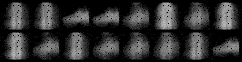
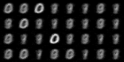
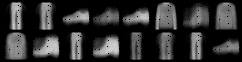
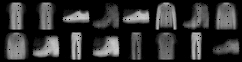
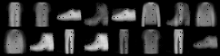
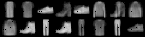

## Variational Auto encoder:
A varitational auto encoder with KL diversion and MSE loss, implemented using pytorch.

## Usage:
`python sparse_ae_kl.py --epochs 10 --reg_param 0.001 --add_sparse yes`

## Results:
<table>
  <tr> 
    <td>  </td>
    <td>  </td>
  </tr>
  <tr>
    <td> Reconstruction in FashionMNIST </td>
    <td> Training output in MNIST </td>
  </tr>
</table>
<!-- 
<table>
    <tr>
      <td>  </td>
  </tr>
  <tr>
      <td>  </td>
  </tr>
  <tr>
      <td>  </td>
  </tr>
    <tr>
      <td>  </td>
  </tr>
 <tr>
      <td>  </td>
  </tr>
</table>
-->
